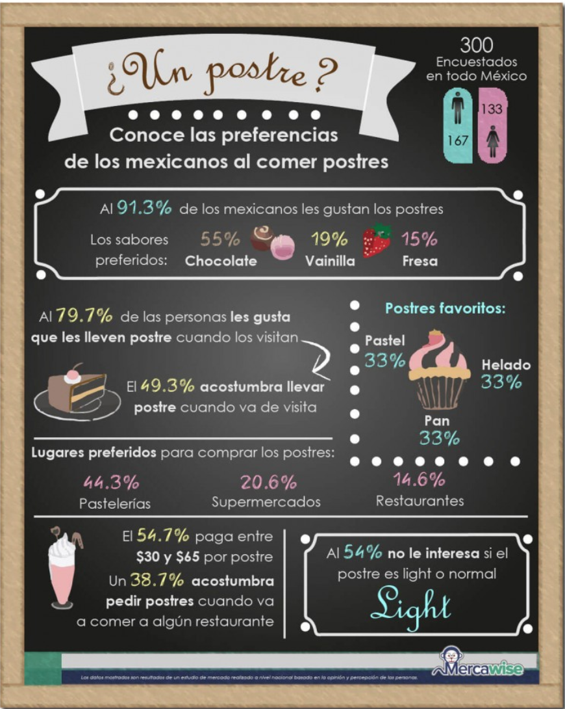
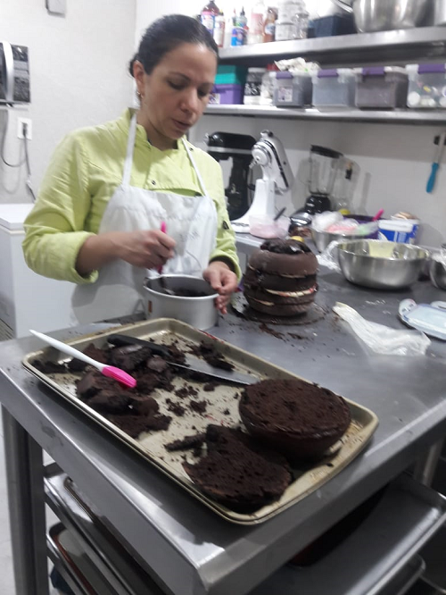
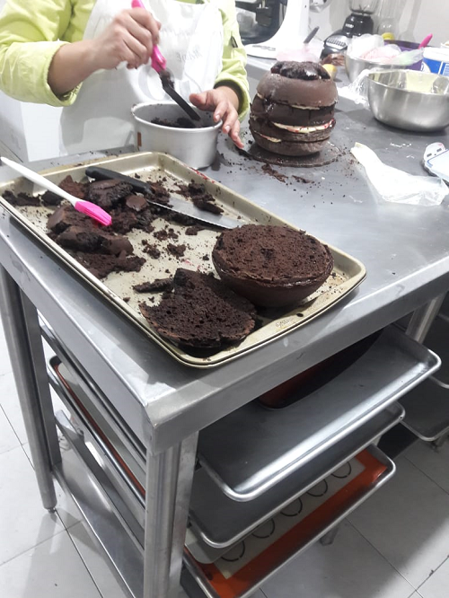
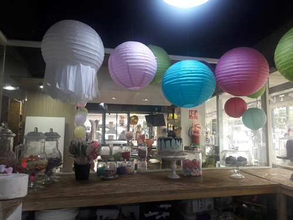
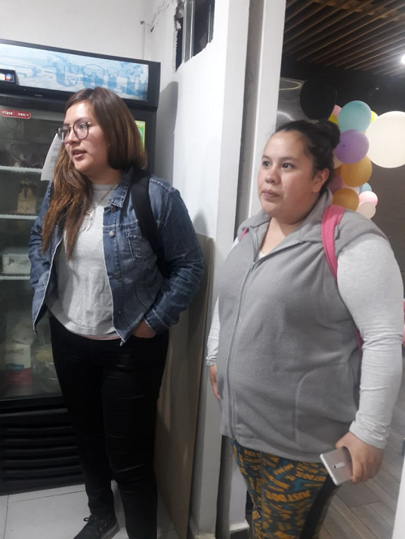

# Propuesta de E-commerce

### Para iniciar ¿Qué es el e-commerce?
El e-commerce o comercio electrónico es un método de compra/venta de bienes, productos o servicios valiéndose de internet como medio, es decir, comerciar de manera online.

Esta modalidad de comercio se ha vuelto muy popular con el auge de Internet ya que cuenta con una serie de ventajas respecto al comercio tradicional:

- Disponibilidad 24 horas durante los 365 días del año para el cliente.
- No existen barreras geográficas para el cliente.
- Ventaja competitiva respecto al comercio tradicional.
- Posibilidad de segmentar a los clientes al trabajar online, mejorando la comunicación y lanzando campañas especializadas.
- Extender el alcance de tu negocio a nuevos usuarios, pero reducirlo respecto a otros.

Por estas razones nos dimos a la tarea de **buscar un posible cliente** que pudiéramos veneficiar comercializando sus productos en Internet y haciendo una minuciosa investigación en sus procesos de compra y venta para ofrecer una experiencia de usuario completa; a continuación los resultados:

## Nuestro cliente

### Dulces Ilusiones - *Pastelería Boutique*

  

### Objetivos de la empresa con el E-commerce.

* Generar una base de clientes potenciales en un lapso de 3 a 6 meses.
* Al ser un proceso personalizado se requiere aumentar las ventas en un 20%, en un lapso de 3 meses.
* Dar una forma fácil para poder contactarse sin necesidad de ir a la tienda en físico.
* Aumentar el número de visitas a nuestro sitio web en un 50% , en los próximos 2 meses.
* Agilizar los procesos en un 50% para realizar una cotización, rápida y efectiva en 2 meses.

### User persona

Para poder conocer a nuestros usuarios utilizamos la técnica User persona.

El resultado es el siguiente:

https://drive.google.com/file/d/13QUHnYRXCee-ZS2nHpM-D75KO7uNCoSP/view?usp=sharing

### Investigación de mercado

#### Benchmarck

El benchmarck a continuación nos ayudara para poder observar la competencia y los modelos que tiene, los que nos pueden funcionar.

https://docs.google.com/spreadsheets/d/1DNVHWcVN5E3stmnuaPCE90LUY42tcgl6J_xmufCRZJA/edit?usp=sharing

* Como pudimos observar el modelo de la tienda merengue merengue cuenta con una excelente logisitica para poder repartir los cupcakes a personas que trabajan en coorporativos.

* El modelo que maneja la panedería "La Esperanza" es muy grande y cuenta con diferentes formas de pago. Y una logistica en la que pide un minimo de compra.

* Este modelo pasado nso podra yaudar a ver como es que agilizan el proceso y ya no les lleva tnsto tiempo en una cotización.

 
#### Entendimiento del problema

Al realizar una entrevista a profundidad con la empresaria pudimos observar lo difícil que es llevar la cotización de un producto ya que solo el 50% de las cotizaciones son realizadas, el problema esta en que ella es la única que puede dar el presupuestos ya que ella es la repostera, un e-commerce le ayudaría a poder realizar de manera mas rápida una cotización y así poder concentrarse en el sabor y la calidad de sus pasteles.

La pastelería lleva un año en el mercado mexicano y ha ido incrementando sus ventas por lo cual ser solo ella por el momento no se da abasto sin embargo el contratar una nueva persona que le ayude con las cotizaciones le conlleva un gasto que por el momento no puedo cubrir.

Recibe al rededor de 15 personas por día, al probar sus clientes los pasteles se vuelven en usuarios recurrentes; a lo largo de la semana llega a tener de entre 3 y 5 clientes nuevos.La mayoría de las cotizaciones son porque van a la tienda o bien por redes social más nunca entran a la página a observar los productos. Sus clientes pueden ser de diferentes áreas de la república mexicana van desde la colonia roma hasta la colonia iztapalapa.

Ella cree que un ecommerce le podría ayudar a que mas gente conozca sus productos y pueda cotizar de una manera rápida sin esperar tener que esperar un mail o bien un lapso par a poder contestar la cotización, le gustaría incluir algunos precios aproximados ya que todo varia dependiendo del pastel y del modelo.

#### Customer Journey Map

