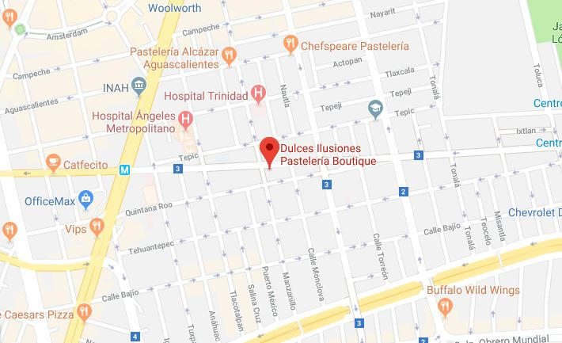
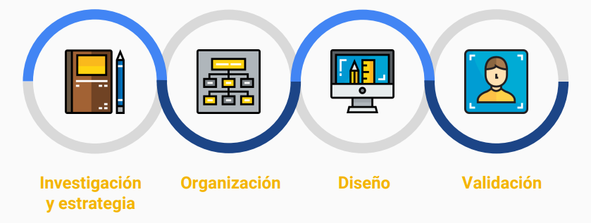
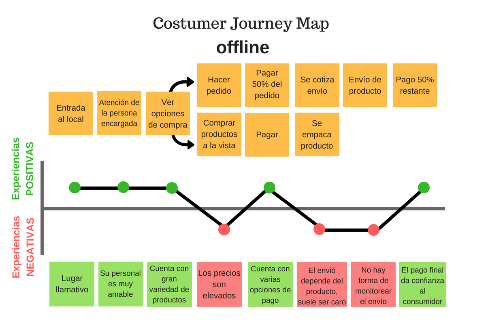
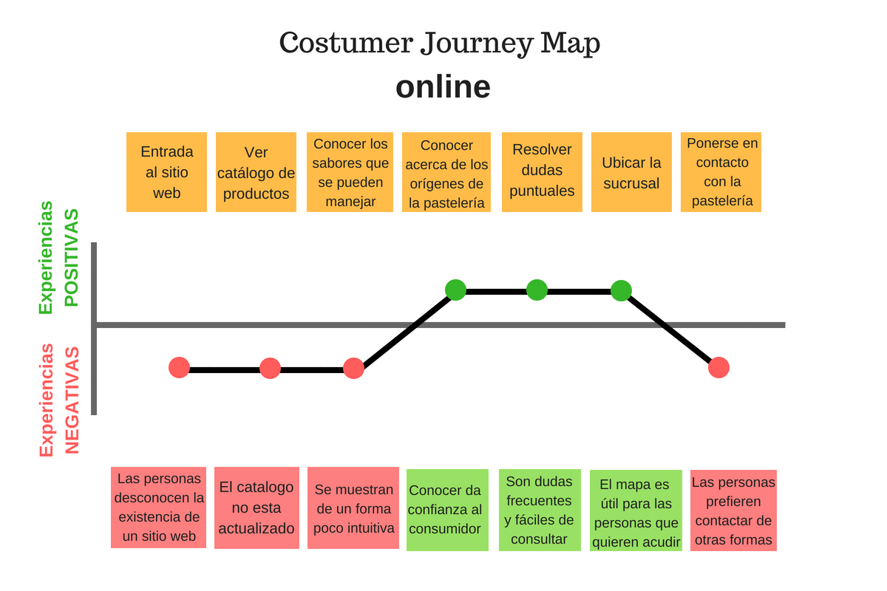

# Propuesta de E-commerce

### Nuestro cliente

**“Dulces Ilusiones”** pastelería boutique es el taller de *Alejandra Velasco* donde diseña los sueños de sus clientes. En este lugar se realizan de manera artesanal espectaculares pasteles, cupckaes, galletas y exquisitas mesas de dulces para todo tipo de celebraciones.

#### A continuación nuestro proceso de trabajo se adapta a la filosofía del diseño centrado en el usuario dividido en las siguientes fases:

## Investigación y estrategia :memo:

### Objetivo de la empresa

El principal objetivo de Alejandra Velasco con dulces ilusiones es brindar a sus clientes la mejor experiencia en el procesos de deleitar el paladar, al tiempo de hacer crecer su negocio, llegar a nuevo público y por ende aumentar sus ventas.

### Problema
Alejandra como CEO de dulces ilusiones lleva a cabo casi todo el proceso de venta y diseño de pasteles. Los siguientes factores son los motivos de las dificultades:

1. Cuenta con un proceso de venta lento.
2. Tiene una página web que no conocen ni utilizan sus clientes.
3. No muestra precios en la página web y pierde tiempo realizando cotizaciones en clientes que al final no están interesados o cotizaciones que ya han sido realizadas y las tiene que volver a efectuar.
4. La información en sus sitio esta des-actualizada y no cuenta con arquitectura de la información.

### Nuestra Propuesta
Al analizar las dificultades de Alejandra, ideamos crear una plataforma que le pueda facilitar el proceso de venta así como llegar a clientes potenciales. Asi mismo agilizar el proceso de cotización al mostrar los precios directamente en la página con posibilidad pe personalizar el pedido.

 - Crear una base de datos de clientes
 - Ofrecer a los clientes una nueva opción de contacto sin necesidad de acudir a la tienda física.
 - Segmentar a los clientes desde un primer contacto.
 - Lanzar novedades.
 - Engagement por la atención personalizada.
 - Generar clientes recurrentes.
 - Aumentar su ticket promedio.
 - Generar un ratio de conversión.(Facebook e instagram a e-commerce)
 
### User persona
Para poder conocer a nuestros usuarios utilizamos la técnica User Persona.
Que hiciste?
Que obtuviste?

El resultado es el siguiente: 

### Empathy Map

### Benchmark

### Documentación de técnicas

## Organización :chart_with_upwards_trend:
User flow
Arquitectura de la información
Card sorting
Flowchart
## Diseño :art:
Wireframes baja fidelidad
Wireframes alta fidelidad
Prototipo clickleable
## Validación :heavy_check_mark:
Observación
Problemas de uso
Corrección de errores